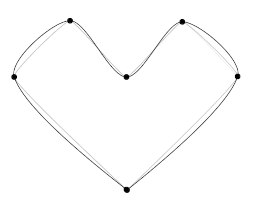

<p align="center">
<h1 align="center">TimeCat</h1>
<div align="center">
A Magical Web Recorder 🖥 网页录屏器
</div>

### Project Description

English | [中文](https://github.com/oct16/TimeCat/blob/master/README.cn.md)

[🖥 DEMO](https://oct16.github.io/TimeCat) Chrome Browser

### Features

04.26 Live Mode    

03.31 Add Chrome Plugin 

### Usage
```ts
// In WIP
import { record, replay } from 'TimeCat';

record(options) 
// or
replay(options)

```

### TimeCat -- A Magical Web Recorder

If you love to play games, you must have played Warcraft 3. You may be curious about the video files exported by the game. After playing the game for an hour, why the video is only a few hundred KB. But soon you will found another problem, you need to reload the map every time when you import the replay video, otherwise, it will not play.

The data recorded in the video is not a video file, but a series of actions with time stamps. When importing the map, it is actually equivalent to an initial state. On the basis of this state, only the previous actions need to be restored. To restore the previous game process, this is the basic principle of reply

For a video, it greatly reduces the size, assuming that we need to record an hour of 1080p24f video, in the case of uncompressed video   
```
Frames = 3600s * 24 = 86400frame

Assume that each logical pixel is represented by three primary colors of RGB, 
each primary color is 8 bits (256 colors)
Frame size = (1920 * 1080) pixels * 8bits * 3 = 49766400bits

Converted to KB is 49766400bits / 8/1024 = 6075KB

Total video volume = 6075KB * 86400 = 524880000KB ≈ 500GB
```

So compared with the traditional video recorder, assuming that the recording is 500KB, then the volume is reduced by about 524880000KB / 500KB ≈ 1000000 times  in theory

In fact, the Web recorder also draws on such an idea, which is generally called Operations Log. In essence, it's recording a series of browser event data, re-render using the browser engine, and restore the previous operations. 

From a practical point of really, even if you compare the compressed video with an H.265 compression ratio of several hundred times, you can save at least 200 times in volume

Compared with traditional video streaming, its better obvious

1. Greatly reduce the size of video files
2. Very low consumption of CPU and memory
3. Lossless display, infinite zoom, window adaptation, etc.
4. Very flexible time jump, almost imperceptible buffer time
5. All information is live (text and pictures can be copied, links can be clicked, and the mouse can scroll)
6. You can easily record the sound, and synchronize the sound with the picture, and also translate the sound into subtitles similar to YouTube
7. It is convenient to modify the details of the video, such as desensitizing the displayed content, generating a heat map, etc.
8. The recorded serialized data is very useful for  the data analysis
   ...

So the question is coming: Why do we have to record web pages? What are the scenarios?

I think of the following aspects

1. The anomaly monitoring system, such as [LogRocket](https://logrocket.com/), it can be understood that he is a tool that integrates Sentry and Web Recorder, which can playback the graphical interface and data logs of webpage errors to help Debugging
2. Record the user's behavior for analysis, such as [MouseFlow](https://mouseflow.com/). [LiveSession](https://livesession.io/), "connect" to the user's to see what people do on the website
3. Monitoring for customer service quality, for example, Alibaba has 100,000 customer service personnel are scattered throughout the country, and they need to record 7x24 hours of their service process. The performance requirements for monitoring on this order of magnitude are very High, Ali's internal tool is called `XReplay`
4. Collaborative tools, web live broadcast, etc., will also involve similar technologies

....

---
### Technical details of the Web Recorder

#### Take a snapshot of the DOM

The node data of the page can be easily obtained through the DOM API, but for our needs, it is obvious that the data provided by the DOM Node is too redundant. This step is to simplify the information by referring to the design of VirtualDom

```ts
interface VNode {
    type: number
    id: number
    tag: string
    attrs: Attrs
    children: VNode[]
    extra: Extra
}
```

After deep traversal of the DOM, the DOM is mapped to a VNode type node. The Nodes to be recorded are mainly three types `` ELEMENT_NODE '', `COMMENT_NODE` and` `TEXT_NODE``. After deserialized, it can be restored the state 

there are some nodes and attributes that need special treatment, such as

- `Input` and other types of` value` `checked` cannot be obtained from the DOM, and need to be obtained from the node
- The content of the `script` tag will not be executed later, so it can be directly skipped or marked as` noscript`
- `SVG` can be obtained directly, but it and it's children needs to use` createElementNS ("http://www.w3.org/2000/svg", tagName) `to create

- If the `src` or` href` attributes are relative paths, they need to be converted to absolute paths
  ......

#### Record Actions that affect page element changes

DOM changes can use `MutationObserver`, listen to` attributes`, `characterData`,` childList` three types of changes
```ts
const observer = new MutationObserver((mutationRecords, observer) => {
    // Record the data
})
observer.observe(target, options)
```

With the help of the ability combination of `WindowEventHandlers`` addEventListener`, etc., you can listen to a series of operation events on the page

- Add Node Action
- Delete Node Action
- Change Attribute Action
- Scroll Action
- Change Location Action
...

Record mouse actions through `mouseMove` and` click` events

For the `MouseMove` event, it will be triggered frequently during the movement, resulting in very redundant data, such data will waste a lot of space, so for the mouse tracking, we only collect a small number of key points, the simplest The method is to use throttling to reduce the amount of data generated by the event, but there are some disadvantages:
    1. Critical mouse coordinate data may be lost in the intercepted
    2. huge data will be generated even if the movement distance is long. The better way is to calculate the movement trajectory through the `Spline Curves`. 

We can watches the input via `input`` blur` `focus` event of` Node.addEventListener`, but this can only listen to the user's behavior. If we assign values ​ via JavaScript, we can't listen to the data Changes, at this time we can hijack some special properties through `Object.defineProperty`, without affecting the target, forward the new value to the custom handle, and handle the change in a unified method

```ts
const elementList: [HTMLElement, string][] = [
        [HTMLInputElement.prototype, 'value'],
        [HTMLInputElement.prototype, 'checked'],
        [HTMLSelectElement.prototype, 'value'],
        [HTMLTextAreaElement.prototype, 'value']
    ]

    elementList.forEach(item => {
        const [target, key] = item
        const original = Object.getOwnPropertyDescriptor(target, key)
        Object.defineProperty(target, key, {
            set: function(value: string | boolean) {
                setTimeout(() => {
                    handleEvent.call(this, key, value)
                })
                if (original && original.set) {
                    original.set.call(this, value)
                }
            }
        })
    })
```

#### Optimization of MutationObserver

Because the DOM Diff Patch is implemented with the MutationObserver, it is necessary to collect and process the changed records, which involves some key issues: For example, the timing of DOM changes is sequential, and Mutation can only be summarized as adding and deleting, However when calling insertBefore or appendChild, it will cause movement. These nodes must be processed and marked as moved, otherwise, the loss of node references may cause rendering errors.

#### MutationObserver compatibility

[Can I Use MutationObserver] (https://caniuse.com/#search=mutationObserver) shows that only in IE11 and later, Android 4.4 and later can be used, compatible with the old browser can be through [mutationobserver-shim] (https: //www.npmjs.com/package/mutationobserver-shim) to support, but using shim may cause some fatal bugs of the collected data. there is also a situation that some websites may block the MutationObserver API, we can restore the `` Native Code '' by creating an Iframe

#### Cross-domain processing of external links

After loading HTML, it will refer to many external resources, usually in many forms

For Example：
- Absolute path  ```` 
- Relative path ```` 
- relative to the current path ```` 
- The Protocol-relative URL````
- [Responsive images](https://developer.mozilla.org/en-US/docs/Learn/HTML/Multimedia_and_embedding/Responsive_images) ``src="www.xxx.png" srcset="www.xxx.png 1x, www.xxx.png 2x"``   
...

The above requires a converter to deal with the path problem. In the ``Deserialize`` stage, they can be converted to the absolute path under the original domain in order to load normally in cross-domain
There is also a situation where the problem of loading resources for third-party resources requires the proxy server.

###### CORS Error

Usually, due to the limitation of the resources of the recorded website with the CORS Policy. The solution is that if the resources are controllable, you can add a white list or ignore it. The other is to use a proxy server.
> Reference article: [3 Ways to Fix the CORS Error](https://medium.com/@dtkatz/3-ways-to-fix-the-cors-error-and-how-access-control-allow-origin-works-d97d55946d9)


#### Rendering time of SPA web page

Before starting to play, we need to restore the previous data to the real DOM. This will take a certain time to get a white page, which depends on your browser performance and recording web page resources. Refer to FMP (First Meaningful Paint), during the loading process, the skeleton map can be dynamically generated from the previously mapped data, and wait for the FMP to send the Ready signal before playing

> Reference article: [Time to First Meaningful Paint](https://docs.google.com/document/d/1BR94tJdZLsin5poeet0XoTW60M0SjvOJQttKT-JK8HI/view#)

#### Simulate mouse path through splines

When the user moves the mouse on the page, many `mouseMove` events are generated. The coordinates and timestamp of the track are obtained through` const { x, y } = event.target`

If I use a mouse to trace a track on the page, I may get the coordinate points like the picture below


However, for the scenario of recording, on most occasions, we do not require 100% restoration of accurate mouse path, and we only care about two situations:
```
1. Where does the mouse click?
2. Where does the mouse stay?
```

After simplifying the mouse path through these two strategies, it takes only about 6 points to draw a 💖, to simulate the virtual path of the mouse through the spline curve



After filtering out the key points through the rules, use the B-spline curve calculation function, When redrawing the mouse position during rendering, you can get a mouse with an approximate curve Track

#### Generate heat map from mouse data

Recorded a coordinate info through a mouse event, by[heatmap.js](https://www.patrick-wied.at/static/heatmapjs/) The heat map can be easily generated for analyzing the user's behavior data.

When the page switches, we need to reset the heat map. If it is a single-page application, pass `History` 的 `popstate` 与 `hashchange` Can monitor changes on the page


#### Desensitization to user privacy

For some personal privacy data, through the annotation of the DOM during development `Node.COMMENT_NODE` like： `<!-- ... -->`）annotation，We can obtain and process. Through the agreed statement, the DOM tag that needs to be desensitized，For example ，if want hide tag```<button>```, we need change to```<!--hidden--><button>```

#### Sandboxing improves safety

The recorded content may be provided by a third party, which means that there may be certain risks. for example: `<div onload="alert('something'); script..."></div>`, or some events in our player may also affect the playback content, so we need a sandbox to isolate the playback environment, HTML5 provides iframe sandbox is good choice, which can help us easily isolate the environment:

- Script cannot be executed
- Cannot send ajax request
- Cannot use local storage, ie localStorage, cookies, etc.
- Cannot create alert and windows, such as window.open or target = "_ blank"
- Cannot send form
- Cannot load additional plugins such as flash etc.
- Cannot perform tricky for autoplay. For example: autofocused, autoplay

#### Play jump and fast forward

Play: The player will have a accurate timer. The action data is stored in a stack. Each data is a frame. With RAF (RequestAnimationFrame) to exec the next frame
Pause: pause timer through cancelAnimationFrame
Fast forward: double the speed of the acquisition rate
Jump: computing by virtualDom

#### Gzip on the client

Gzip generally compresses the transmitted data in the network application layer, but our data does not only in the database, there may be three storage type:
1. The server stores TCP => DB
2. Local storage LocalStorage, IndexedDB, Web SQL
3. The data is persisted in the script and saved as a local file, such as directly exporting a working HTML file

Greatly reducing the data size before exporting or transmitting,

On the client-side, the compression based on `Gzip`, I chose [Pako](https://nodeca.github.io/pako/)   

#### Data upload

For client data, you can use indexedDB. indexedDB will be much larger than LocalStorage, generally no less than 250MB, or even no upper limit. In addition, it uses object store and supports transaction, The important point is that it is asynchronous, which means it will not block the operation of the Web Recorder
After that, the data can be uploaded to the OSS server.

#### Load SDK

The RollUp packer can generate multiple formats, such as `` IIFE `` and `` ESM ``, etc.
Load the SDK in the project or use the Chrome plug-in to inject the IIFE module, you can easily to control the data recording

#### Thanks

Thanks to Ali's XREPLAY for inspiration 
Thanks to RRWEB for technical sharing
