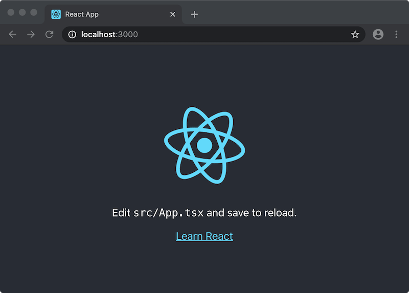
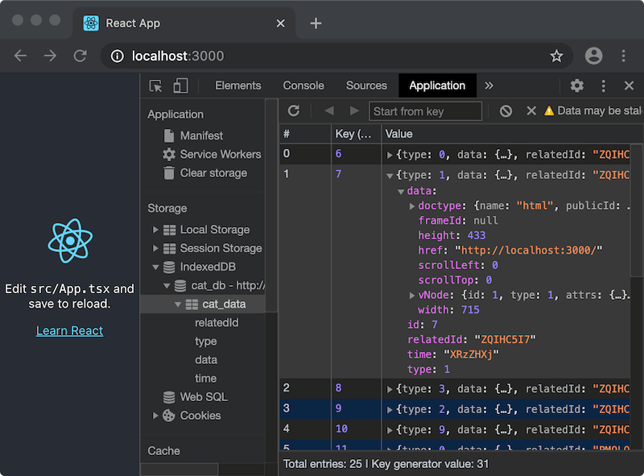
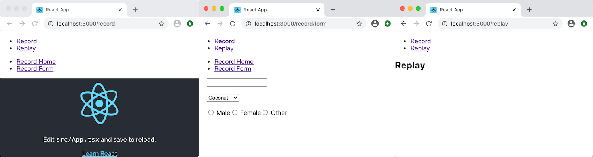

## TimeCat 入门：我们的第一个应用

### 欢迎一起来研究 TimeCat !

本教程将通过一个简单网站，实现录制与播放功能，向你介绍 TimeCat 的基本知识，利用 TimeCat 提供的 API，实现一些有意思的功能。为了帮助你更好地起步，本指南提供了一个已完成的简单应用，我们可以在此基础上测试与修改。


### 创建一个Web新项目

这里我们利用 Create React App 来创建一个最简易的网站，TimeCat 使用 TypeScript 语言编写，这里也推荐大家使用 TypeScript 来构建我们的项目

```bash
$ npx create-react-app first-timecat-demo --template typescript
```

接下来, 我们来安装 TimeCat，在 npm 中的包名称是 [timecatjs](https://www.npmjs.com/package/timecatjs)

```bash
$ cd first-timecat-demo
$ npm i timecatjs -D
```
安装好之后，通过命令让项目跑起来吧

```bash
$ npm run start
```

一个最简单的网页就运行起来了，如下图



### 通过一行代码来实现录制功能

```ts
// path/to/src/App.tsx

import { Recorder } from "timecatjs";
new Recorder()
```

这时候我们的录屏器已经默默开始运行了，TimeCat 默认会把数据存储在浏览器内置数据库 **IndexedDB** 中，当我们需要播放录制的数据的时候，播放器会从数据中读取数据进行播放



### 把录制和播放功都集成到网页里

我们设计的网站一共有三个页面：

1. 一个带有 React Logo 的主页，对该页面进行录制
2. 一个表单页面，可以输入内容，对该页面进行录制
3. 一个回放页面，播放刚才录制的两个页面的录像

开始把！

首先我们为网站添加一个路由

```bash
$ npm i react-router-dom -D
```

并把路由引入到项目中

```ts
// path/to/src/App.tsx

import { BrowserRouter as Router, Link, Switch, Route } from "react-router-dom";
```

我们把项目拆分成两个入口，分别是 ``Record 录制`` 与 ``Replay 播放``

```ts
// path/to/src/App.tsx

import React from "react";
import "./App.css";
import { BrowserRouter as Router, Link, Switch, Route, Redirect } from "react-router-dom";
import Replay from "./components/Replay";
import Record from "./components/Record";

function App() {
  return (
    <Router>
      <ul>
        <li>
          <Link to="/record">Record</Link>
        </li>
        <li>
          <Link to="/replay">Replay</Link>
        </li>
      </ul>
      <Switch>
        <Route path="/record" component={Record}></Route>
        <Route exact path="/replay" component={Replay}></Route>
        <Redirect exact to="/record" from="/" />
      </Switch>
    </Router>
  );
}

export default App;
```

建立我们要录制的两个页面 ``Home 主页`` 与 ``Form 表单``

```ts
// path/to/src/components/Home.tsx

import React, { Component } from "react";
import logo from "../logo.svg";

export default class Home extends Component {
  render() {
    return (
      <div className="App">
        <header className="App-header">
          
          <p>
            Edit <code>src/App.tsx</code> and save to reload.
          </p>
          <a
            className="App-link"
            href="https://reactjs.org"
            target="_blank"
            rel="noopener noreferrer"
          >
            Learn React
          </a>
        </header>
      </div>
    );
  }
}
```


```ts
// path/to/src/components/Form.tsx

import React, { Component } from "react";

export default class Form extends Component {
  render() {
    return (
      <div style={{ margin: "0 20px" }}>
        <input type="text" />
        <br />
        <br />
        <select defaultValue="lime">
          <option value="grapefruit">Grapefruit</option>
          <option value="lime">Lime</option>
          <option value="coconut">Coconut</option>
          <option value="mango">Mango</option>
        </select>
        <br />
        <br />
        <div>
          <input defaultChecked type="radio" value="Male" name="gender" /> Male
          <input type="radio" value="Female" name="gender" /> Female
          <input type="radio" value="Other" name="gender" /> Other
        </div>
      </div>
    );
  }
}
```

把 ``Home 主页`` 与 ``Form 表单`` 两个页面集成到 ``Record 录制 `` 页面中


```ts
// path/to/src/components/Record.tsx

import { BrowserRouter as Router, Link, Switch, Route } from "react-router-dom";
import Home from "../components/Home";
import Form from "../components/Form";

import React, { Component } from "react";

export default class Record extends Component {
  render() {
    return (
      <Router>
        <div>
          <ul>
            <li>
              <Link to="/record">Record Home</Link>
            </li>
            <li>
              <Link to="/record/form">Record Form</Link>
            </li>
          </ul>
          <Switch>
            <Route exact path="/record" component={Home}></Route>
            <Route path="/record/form" component={Form}></Route>
          </Switch>
        </div>
      </Router>
    );
  }
}
```

最后是一个空白的 ``Replay 播放`` 页面，我们稍后会进行改造

```ts
// path/to/src/components/Replay.tsx

import React, { Component } from "react";

export default class Replay extends Component {
  render() {
    return (
      <div>
        <h2>Replay</h2>
      </div>
    );
  }
}
```

创建好以上几个网站之后，可以看到如下的效果，网站中的几个链接是可以相互跳转的



### 使用 TimeCat Recorder 对网站进行录制

在 ``Record`` 组件内引入 ``timecatjs`` 的 ``Recorder`` 模块
```ts
// path/to/src/components/Record.tsx
import { Recorder } from "timecatjs";
```

在 ``Record`` 类中加入 ``componentDidMount`` 和 ``componentWillUnmount`` 两个方法，当组件激活的时候，也就是跳转到 ``/record`` 路径内的时候，需要对整个网站进行录制，当组件销毁的时候，我们也要把 ``Recorder`` 销毁掉，停止录制视频

```ts
// path/to/src/components/Record.tsx

export default class Record extends Component {
  recorder?: Recorder;
  async componentDidMount() {
    this.recorder = new Recorder();
  }
  async componentWillUnmount() {
    this.recorder?.destroy();
  }
  render() {
    return ...
  }
}
```

在组件内引入 ``timecatjs`` 的 ``Player`` 模块，其中的参数 ``target`` 表示选取该元素作为容器，播放器会注入到容器中，容器元素需要指定宽度与高度，播放器会根据容器的大小进行自适应，若 ``target`` 为空表示播放器会注入到 ``document.body`` 中

```ts
// path/to/src/components/Replay.tsx

import React, { Component } from "react";

import { Player } from "timecatjs";
export default class Replay extends Component {
  player?: Player;
  async componentDidMount() {
    this.player = new Player({
      target: ".timecat-replay"
    });
  }
  async componentWillUnmount() {
    this.player?.destroy()
  }
  render() {
    return (
      <div>
        <h2>Replay</h2>
        <div
          className="timecat-replay"
          style={{ margin: "0 auto", width: "600", height: "400px" }}
        ></div>
      </div>
    );
  }
}

```

这时候已经可以看到录制效果了，以上代码见： https://github.com/oct16/timecat-demo/tree/master
